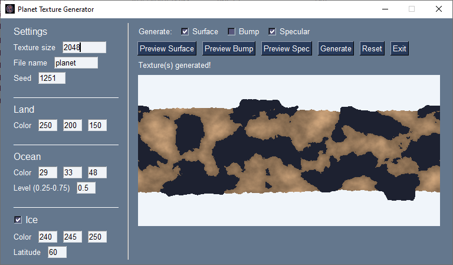

# Planet Texture Generator
This program randomly generates terrestrial planet textures. It's still a work-in-progress and the code is
somewhat messy, but it's definitely usable. Please report any bugs you find on the Issues page!

There are two ways to run the program. On any operating system, you can install [Python](https://www.python.org/) 3
and the following modules: [noise](https://pypi.org/project/noise/), [Pillow](https://pillow.readthedocs.io/en/stable/),
and [PySimpleGUI](https://pysimplegui.readthedocs.io/en/latest/), and run the program from IDLE or the command line.
For Windows users, there is also a Windows executable available under "Releases".

The icon for the program is a picture of Kepler-1649c in [Celestia](https://github.com/CelestiaProject/Celestia)
(the texture is older than the generator, not made with it). Credit goes to **nussun** for originally finding the
method this program uses to generate planet textures while working on her [star texture generator](https://github.com/nussun-celestia/StarTexGen).

Here's a screenshot to show what the program looks like:

and an example of its output:

